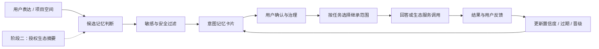

# PRD：千问「意图记忆与可选择继承」

> 从“能办事”到“持续懂用户”的可信个人 AI 助手

## 1. 文档信息

| 字段 | 内容 |
| --- | --- |
| 产品名称 | 千问「意图记忆与可选择继承」 |
| 文档类型 | PRD / 产品需求文档 / 面试作品集 |
| 版本 | v2.0 |
| 日期 | 2026-06-10 |
| 阶段一范围 | 千问对话记忆、项目空间记忆、可选择继承、透明治理 |
| 阶段二方向 | 在用户逐项授权后，以阿里生态行为摘要增强意图识别 |
| 产品定位 | 在千问已有生态办事能力之上，构建可解释、可管理、可选择继承的可信意图记忆层 |

## 2. 一页产品判断

### 2.1 已有能力：千问已经能够连接真实服务

2026 年 1 月 15 日，阿里巴巴正式宣布千问 App 接入淘宝、淘宝闪购、支付宝、飞猪和高德等核心生态服务，并开放点外卖、购物、支付、旅行规划与预订等能力。千问正在从“回答问题的模型入口”转向“能够协调服务并完成任务的 AI 助手”。

这意味着，“千问是否应该结合阿里生态”已经不是待验证的产品假设。阿里的公开产品动作已经证明：**模型能力与生态服务结合，是千问面向个人 AI 助手演进的明确方向。**

### 2.2 当前缺口：能完成一次任务，不等于长期理解用户

生态调用解决的是“这次如何把事情办完”，但个人助手还需要解决三个连续性问题：

1. **目标不连续**：用户上周制定的备考计划、长期预算或写作要求，下一次任务中仍可能需要重新说明。
2. **意图不沉淀**：一次次对话和任务执行包含偏好与阶段目标，但尚未形成用户可查看、可修正的长期理解。
3. **继承不可控**：历史偏好有时能提高效率，有时会干扰客观评估、风险判断或一次性敏感咨询。

因此，千问下一阶段的差异化不只是连接更多服务，而是让服务调用前后的信息形成可控闭环：

> 理解用户意图 -> 选择性继承相关记忆 -> 调用生态服务完成任务 -> 接收用户反馈 -> 更新对用户的理解

### 2.3 产品机会：在模型层与生态执行层之间增加可信意图记忆层

本方案不是简单增加“记住更多”的功能，而是建立一套用户可理解、可干预的意图记忆机制：

- 将分散的表达转化为结构化意图，而不是保存聊天流水。
- 判断什么值得长期记、什么只能停留在当前上下文。
- 允许用户决定本次任务继承哪些历史信息。
- 先通过低敏感的对话与项目记忆建立信任，再引入授权生态行为摘要。

## 3. 产品目标与边界

### 3.1 用户目标

1. 减少在长期任务中重复说明目标、约束和输出偏好的成本。
2. 清楚知道千问记住了什么、为什么记住、何时会使用。
3. 能够确认、修正、暂停和删除记忆，并查看记忆的调用情况。
4. 在客观评估或敏感任务中，能够选择只继承稳定偏好或完全不继承。

### 3.2 业务目标

1. 补齐千问从“服务调度入口”向“可信个人 AI 助手”演进所需的持续理解能力。
2. 提升学习、项目协作、内容创作等长期任务的复用率和完成效率。
3. 为后续生态 Agent 提供经过用户授权与校准的意图输入，降低错误执行风险。
4. 建立跨场景个性化能力的信任基础，而不是依赖黑箱画像提升短期点击或交易。

### 3.3 核心原则

1. **先信任，后扩源**：先做好对话和项目空间记忆，再引入生态行为摘要。
2. **记意图，不存流水**：长期记忆保存必要摘要，不汇集完整聊天、订单、轨迹或账单流水。
3. **调用授权不等于记忆授权**：用户允许千问调用淘宝下单，不代表允许将淘宝历史行为用于长期记忆。
4. **相关才继承**：不同场景按最小必要原则召回，不建立默认全局生效的统一画像。
5. **用户拥有最终解释权**：用户主动修正的信息优先于模型推断。

### 3.4 非目标

1. 阶段一不读取淘宝订单、高德轨迹、支付宝账单等生态行为数据。
2. 不在阶段一打通所有阿里生态产品或建立集团级用户数据池。
3. 不做医疗诊断、金融授信、未成年人画像等高风险推断。
4. 不将意图记忆直接用于广告投放；商业推荐如需使用，必须另行授权。
5. 不承诺记住所有对话内容，即时上下文默认不进入长期记忆。

## 4. 分阶段产品路线

### 4.1 阶段一：可信记忆基础层（本期 MVP）

**目标**：验证用户是否愿意让千问形成长期理解，以及透明、修正、删除和选择继承能否建立信任。

允许使用的记忆来源：

| 来源 | 进入方式 | 示例 |
| --- | --- | --- |
| 千问普通对话 | 用户明确表达或模型生成候选记忆 | “接下来三个月准备产品经理面试” |
| 千问项目空间 | 从项目目标、资料和用户要求中提炼 | “该项目输出默认使用中文产品文档格式” |
| 用户主动强调 | 用户使用“记住”“以后都按这个”等表达 | “记住我不希望简历使用夸张措辞” |

阶段一不使用生态行为信号。即使千问已经能够调用淘宝、飞猪、高德等服务，也不默认读取这些服务中的历史行为用于记忆。

### 4.2 阶段二：授权生态意图增强

只有当阶段一达到以下门槛后，才进入生态行为摘要试点：

- 记忆确认率达到 70% 以上。
- 记忆召回相关率达到 80% 以上。
- 删除与暂停链路通过安全验收。
- 隐私投诉率未触发停止扩量红线。

候选数据范围：

| 生态场景 | 仅允许进入的摘要 | 不允许直接进入记忆层的内容 |
| --- | --- | --- |
| 淘宝 / 淘宝闪购 | 品类倾向、预算区间、稳定复购倾向 | 完整订单、收货地址、单次敏感商品 |
| 高德 / 飞猪 | 用户确认的出行偏好、行程类型 | 连续轨迹、常驻地址推断、同行人关系 |
| 夸克 / 学习场景 | 学习主题、资料类型、阶段进度 | 原始搜索历史、完整文件内容 |
| 支付宝 | 用户主动选择的预算或办事场景摘要 | 完整账单、资产、信用与关系推断 |

阶段二必须针对“数据来源、使用目的、适用场景、保存期限”重新授权。服务调用授权与行为数据用于记忆的授权分别管理、分别撤回。

## 5. 目标用户与核心场景

### 5.1 目标用户

| 用户 | 特征 | 主要痛点 |
| --- | --- | --- |
| 长期学习型用户 | 备考、转行或持续学习，计划和资料分散 | 每次都要重述目标、进度与薄弱项 |
| 项目协作型用户 | 使用千问处理持续数周的研究、文档或创作项目 | 项目规则和决策难以跨会话延续 |
| 内容评审型用户 | 先与 AI 共创，再要求客观评价作品 | 历史共创立场可能影响评估可信度 |
| 生活规划型用户 | 已使用千问完成消费、出行等任务 | 希望建议逐渐贴合自己，但担心被过度画像 |

### 5.2 阶段一场景 A：学习计划持续调整

用户在普通对话中表示“未来三个月准备产品经理面试”，并在项目空间上传岗位要求和个人经历。千问生成一条“产品经理求职准备”的阶段性需求记忆，设置三个月有效期。

当用户一周后询问“今天学什么”时，千问可以继承目标与项目进度生成计划，同时询问近期变化。用户无需重新解释完整背景。

关键点：阶段目标必须设置有效期，过期后需要重新确认，不能永久固化用户状态。

### 5.3 阶段一场景 B：项目空间规则延续

用户在一个作品集项目中持续要求“结论先行、不要使用夸张表述、所有事实标注来源”。千问识别这是项目空间内反复出现且可验证的输出偏好，生成项目级候选记忆。

用户确认后，该记忆默认仅在当前项目中继承，不影响其他聊天。

关键点：项目记忆与全局记忆分开管理，避免局部规则污染所有任务。

### 5.4 阶段一场景 C：独立评估

用户与千问多轮共创一份简历后，提出“客观评价一下这份简历”。千问提示可切换到“不继承”模式：不参考历史共创立场和阶段目标，只基于简历文本、岗位要求和统一评价标准输出结论。

关键点：可信助手不仅要知道何时使用记忆，也要知道何时不使用。

### 5.5 阶段二场景 D：健康消费意图增强

用户曾主动确认“近期希望控制夜间高热量饮食”。在另行授权淘宝闪购行为摘要后，系统发现夜间高热量品类频率持续变化，但不会直接下结论。

当用户询问“今晚吃什么”时，千问可以轻提示：“你之前确认过控制夜间高热量饮食的目标，今晚是否继续按这个目标推荐？”

关键点：生态信号用于验证和更新用户已知目标，不应仅凭消费行为推断健康状态。

## 6. 产品方案概述

### 6.1 核心能力

1. **候选记忆判断**：判断一条信息是否值得进入长期记忆。
2. **意图记忆卡片**：将目标、偏好和约束转化为可读、可管理的结构化记忆。
3. **千问对我的理解**：集中展示来源、置信度、范围、有效期和调用记录。
4. **三级选择性继承**：完整继承、仅继承稳定偏好、不继承。
5. **动态更新与晋级**：根据时间、用户反馈、异常偏差和多信号一致性调整记忆。
6. **回答级来源说明**：让用户知道本次回答受哪些记忆影响。

### 6.2 产品价值链

### 6.3 记忆与生态执行的关系

| 层级 | 解决的问题 | 示例 |
| --- | --- | --- |
| 模型理解层 | 用户当前在说什么 | 理解“安排一下这周复习” |
| 可信意图记忆层 | 哪些历史目标值得在本次任务中使用 | 继承三个月备考目标和当前进度 |
| 生态执行层 | 如何完成真实世界任务 | 调用飞猪、高德或淘宝闪购完成任务 |

意图记忆层不是替代生态调用，而是为调用提供经过用户校准的持续意图，并在执行后接收反馈。

## 7. 功能需求

### 7.1 F1 记忆总开关与分层授权（P0）

阶段一授权项：

| 维度 | 选项 |
| --- | --- |
| 记忆来源 | 普通对话、项目空间、用户主动记忆 |
| 生效范围 | 全局、指定场景、指定项目 |
| 使用方式 | 允许生成候选、允许当前任务召回、允许写入新记忆 |

阶段二新增独立授权项：

| 维度 | 选项 |
| --- | --- |
| 生态来源 | 淘宝、淘宝闪购、高德、飞猪、夸克、支付宝等逐项开关 |
| 数据形式 | 仅行为摘要，不传入完整原始流水 |
| 使用目的 | 更新已有目标、生成候选偏好、辅助当前建议 |
| 保存期限 | 单次、7 天、30 天或用户自定义 |

规则：

1. 阶段一默认仅开启用户主动要求记住的内容；自动候选记忆需用户主动开启。
2. 项目空间记忆默认仅在对应项目内生效。
3. 阶段二每个生态来源必须单独授权，且不能与服务调用授权合并勾选。
4. 关闭读取权限后不得新增相关记忆；撤回已生成记忆需另行选择暂停或删除。
5. 授权文案必须说明“使用什么、为了什么、在哪些场景生效、保留多久”。

### 7.2 F2 候选记忆价值判断（P0）

系统从四个维度判断信息是否值得进入长期记忆：

| 维度 | 判断问题 | 处理方式 |
| --- | --- | --- |
| 高频性 | 是否在多个时间点重复出现 | 重复越多，候选权重越高 |
| 场景相关性 | 是否能明显改善未来同类任务 | 仅绑定相关场景或项目 |
| 敏感程度 | 是否涉及健康、财务、关系等敏感信息 | 默认待确认或禁止生成 |
| 可验证性 | 是否来自用户明确表达或多个独立信号 | 可验证性越高，置信度越高 |

准入规则：

1. 用户明确说“请记住”时，可直接生成用户明确记忆。
2. 普通表达只有在未来复用价值明确时才生成候选卡片。
3. 即时情绪、单次需求、临时地点等默认只进入当前上下文。
4. 单次行为不能直接形成稳定偏好。
5. 敏感推断不得静默生效，必须由用户确认。

### 7.3 F3 记忆类型与意图卡片（P0）

#### 记忆类型

| 类型 | 定义 | 示例 | 默认策略 |
| --- | --- | --- | --- |
| 用户明确记忆 | 用户主动要求长期记住的事实或约束 | 不在简历中使用夸张措辞 | 直接写入，可随时编辑 |
| 稳定行为偏好 | 跨时间重复且未来可复用的习惯 | 项目文档偏好结论先行 | 达到阈值后待确认 |
| 阶段性需求 | 有开始与结束周期的目标 | 三个月内准备产品经理面试 | 必须设置有效期 |
| 敏感推断 | 涉及健康、财务、家庭等推断 | 可能希望控制饮食支出 | 默认待确认，不主动生效 |

#### 意图卡片字段

| 字段 | 说明 | 示例 |
| --- | --- | --- |
| memory_id | 记忆唯一 ID | mem_001 |
| memory_type | 记忆类型 | 阶段性需求 |
| scene | 适用场景 | 求职准备 |
| project_scope | 是否限定项目 | 产品作品集项目 |
| summary | 用户可读摘要 | 未来三个月准备产品经理面试 |
| source_summary | 来源摘要 | 来自两次对话与当前项目目标 |
| evidence_count | 独立证据数量 | 2 |
| confidence | 置信度 | 高 / 中 / 低 |
| inheritance_level | 允许继承层级 | 完整继承时使用 |
| refresh_cycle | 更新周期 | 每周 / 每月 / 到期复核 |
| expires_at | 有效期 | 2026-09-10 |
| status | 状态 | 待确认 / 已确认 / 已暂停 / 已删除 |

### 7.4 F4 记忆更新、异常触发与晋级（P0）

更新节奏：

| 记忆层级 | 更新策略 |
| --- | --- |
| 即时上下文 | 仅在当前会话或任务中生效，不进入长期记忆 |
| 阶段性需求 | 按任务进度更新，到期必须复核 |
| 稳定行为偏好 | 按周聚合信号，避免被单次变化覆盖 |
| 深度画像类总结 | 最多按月复核，不直接展示为人格标签 |

异常触发：

1. 当前表达与已有记忆显著冲突时，优先询问，不沿用旧记忆。
2. 用户连续两次标记“不相关”时，自动降低召回权重并提示是否暂停。
3. 阶段目标到期或长时间未使用时，进入待复核状态。

记忆晋级规则：

1. 单一信号源发生变化，只调整置信度，不改变记忆层级。
2. 多个独立信号在不同时间持续一致，才可从候选偏好晋级为稳定偏好。
3. 用户主动校准拥有最高优先级，可以直接修改摘要、范围和有效期。
4. 敏感推断不能通过自动晋级变为直接生效状态。

### 7.5 F5 “千问对我的理解”透明面板（P0）

入口：

1. 千问设置页：个性化与记忆。
2. 项目空间：项目记忆。
3. 回答底部来源说明：查看本次使用的记忆。
4. 新记忆提醒：查看并确认候选卡片。

页面结构：

| 区域 | 内容 |
| --- | --- |
| 总开关 | 是否允许生成和使用长期记忆 |
| 来源管理 | 对话、项目空间及阶段二生态来源开关 |
| 范围筛选 | 全局、场景、项目、敏感待确认 |
| 记忆卡片 | 摘要、类型、来源、置信度、证据数量、有效期 |
| 操作 | 确认、修正、暂停、删除、调整范围、查看调用记录 |
| 说明 | 关闭、暂停、删除之间的区别与生效时间 |

### 7.6 F6 三级可选择继承（P0）

用户在任务发起前或回答过程中，可以切换本次任务的继承范围：

| 模式 | 继承范围 | 典型任务 |
| --- | --- | --- |
| 完整继承 | 继承相关目标、稳定偏好和项目上下文 | 学习计划、持续项目、个性化建议 |
| 仅继承稳定偏好 | 不继承阶段目标、敏感推断和历史共创立场 | 通用写作、陌生领域咨询 |
| 不继承 | 不读取长期记忆，也不将本次内容写入记忆 | 客观评估、敏感咨询、一次性任务 |

规则：

1. 系统只能推荐模式，不能替用户永久切换设置。
2. 默认只召回当前任务相关的最小记忆集合。
3. 用户说“客观评价”“重新判断”“不要参考之前内容”时，轻提示切换为不继承。
4. 用户在任务中切换模式后，应立即说明哪些历史信息已停止生效。

### 7.7 F7 回答级来源说明与反馈（P1）

当记忆实质影响回答或生态服务调用时，回答底部展示：

> 本次使用了 2 条记忆：产品经理求职目标、当前项目输出偏好。查看或调整

用户可以执行：

| 操作 | 系统结果 |
| --- | --- |
| 本次相关 | 提高该记忆在当前任务类型中的召回权重 |
| 本次不相关 | 降低当前任务类型中的召回权重 |
| 内容有误 | 进入修正流程，不继续沿用错误摘要 |
| 本次不再使用 | 从当前上下文移除，不改变长期状态 |

### 7.8 F8 独立评估任务模板（P0）

独立评估不是单独的记忆体系，而是“不继承”模式的预设任务模板。

触发场景：

- 客观评价、打分、找问题。
- 简历、方案、作品评审。
- 风险判断或是否值得购买。
- 用户明确要求重新判断。

开启后：

1. 不继承历史共创立场、阶段目标和个性化结论。
2. 允许读取用户在当前任务中主动提供的材料和评价标准。
3. 回答底部展示“本次为独立评估，未使用长期记忆”。

## 8. 安全、隐私与合规

### 8.1 数据边界

1. 阶段一仅处理千问内部的对话和项目空间信息。
2. 阶段二只接收生态产品输出的必要行为摘要，不在记忆层汇集完整原始流水。
3. 服务调用、当前任务临时读取、生成长期记忆是三种不同权限，分别授权。
4. 用户删除记忆后，该记忆立即停止召回，并在规定 SLA 内完成存储删除。
5. 所有记忆生成、修改、调用和删除保留可审计记录。

### 8.2 风险与处理策略

| 风险 | 典型表现 | 处理策略 |
| --- | --- | --- |
| 被监视感 | 千问突然提及用户未主动表达的行为 | 阶段一不读生态行为；阶段二逐项授权并说明来源 |
| 错误固化 | 单次表达被长期当作稳定偏好 | 四维价值判断、证据数量、有效期和异常复核 |
| 跨场景污染 | 求职项目规则影响生活咨询 | 场景和项目范围隔离，最小相关召回 |
| 共创偏见 | AI 因参与创作而给出偏袒评价 | 独立评估模板默认建议不继承 |
| 敏感推断冒犯 | 根据消费推断健康或财务状态 | 默认待确认，使用询问式表达，禁止自动晋级 |
| 授权混淆 | 用户以为下单授权等于数据被长期记住 | 服务调用授权与记忆授权拆分展示 |
| 删除不彻底 | 页面删除后仍影响回答 | 立即停止召回、异步物理删除、审计验证 |

## 9. 技术可行性与成本

### 9.1 逻辑链路

1. 对话或项目空间事件进入规则预过滤。
2. 小模型判断是否具有长期复用价值，并完成场景与敏感分类。
3. 大模型仅对高价值候选生成用户可读摘要。
4. 安全策略判断直接写入、待确认或禁止生成。
5. 召回层根据当前任务、继承模式、范围、置信度和有效期选择记忆。
6. 回答或服务调用后收集反馈，更新权重与状态。
7. 阶段二生态系统只输出授权范围内的行为摘要，不向记忆层开放原始数据库。

### 9.2 成本控制

| 成本 | 控制方式 |
| --- | --- |
| 意图提取调用 | 规则过滤 + 小模型分类 + 高价值候选才调用大模型 |
| 召回与上下文 | 按任务召回最小集合，限制记忆条数和 token 预算 |
| 存储 | 保存结构化摘要、版本和审计记录，不复制原始数据 |
| 用户确认打扰 | 聚合展示低风险候选，敏感和高影响记忆即时确认 |
| 跨业务接入 | 阶段二先做单一场景试点，再扩展数据源 |

## 10. 指标体系与实验设计

### 10.1 北极星指标

**可信记忆任务增益率**：启用记忆后，在未显著增加错误与隐私压力的前提下，长期任务完成效率或用户采纳率相对无记忆版本的提升比例。

该指标同时要求“有效”和“可信”，不能只追求记忆调用次数。

### 10.2 核心指标

| 指标 | 口径 | 阶段一目标 |
| --- | --- | --- |
| 候选记忆确认率 | 用户确认的候选卡片 / 展示的候选卡片 | >= 70% |
| 记忆召回相关率 | 被标记相关的调用 / 获得反馈的调用 | >= 80% |
| 重复说明减少率 | 同类长期任务中重复背景字数下降比例 | >= 20% |
| 任务继续率 | 使用记忆后继续完成下一步的任务占比 | 相对基线提升 10% |
| 错误记忆修正率 | 被修改或标记错误的记忆 / 已生效记忆 | 作为质量诊断指标 |
| 记忆关闭与删除率 | 关闭功能或删除记忆的用户占比 | 观察信任压力，不单独追求低值 |
| 隐私投诉率 | 记忆相关投诉 / 启用用户数 | 设红线，触发即停止扩量 |
| 独立评估使用率 | 建议开启后选择不继承的任务占比 | 判断用户是否理解该价值 |

### 10.3 阶段一实验

| 分组 | 能力 | 验证目的 |
| --- | --- | --- |
| A 组 | 仅当前对话上下文 | 基线 |
| B 组 | 对话长期记忆 | 验证跨会话价值 |
| C 组 | 对话记忆 + 项目空间记忆 + 三级继承 | 验证完整可信记忆机制 |

样本场景：学习计划、求职准备、持续项目、内容评审。

### 10.4 阶段二实验

在阶段一用户中再次随机分组：

| 分组 | 能力 | 验证目的 |
| --- | --- | --- |
| D 组 | 仅对话与项目记忆 | 阶段二基线 |
| E 组 | 增加单一授权生态摘要 | 验证生态信号的真实增益与隐私成本 |

阶段二不得同时接入多个生态来源，否则无法判断增益来自哪个信号，也会放大授权压力。

## 11. 版本规划

| 阶段 | 时间 | 核心目标 | 交付内容 | 放量门槛 |
| --- | --- | --- | --- | --- |
| 0. 需求验证 | 第 1-2 周 | 验证用户对记忆控制和继承模式的理解 | 访谈、原型、文案测试 | 用户能区分暂停、删除和不继承 |
| 1. 可信记忆 MVP | 第 3-7 周 | 建立对话与项目空间记忆闭环 | 候选判断、意图卡片、透明面板、三级继承 | 功能与安全验收通过 |
| 2. 小流量实验 | 第 8-11 周 | 验证任务增益与信任指标 | A/B/C 实验、埋点、审计与投诉处理 | 确认率 >= 70%，相关率 >= 80% |
| 3. 单生态试点 | 第 12 周后 | 验证授权行为摘要的增量价值 | 单一生态来源、独立授权、D/E 实验 | 增益显著且未触发隐私红线 |
| 4. 跨场景扩展 | 试点通过后 | 形成理解与执行闭环 | 更多场景、异常更新、跨服务协作 | 每个来源单独评审 |

## 12. 验收标准

### 12.1 功能验收

1. 用户可以分别管理普通对话记忆、项目空间记忆和主动记忆。
2. 系统能够生成四类意图卡片，并展示来源、证据数量、置信度、范围和有效期。
3. 用户可以确认、修正、暂停、删除和查看记忆调用记录。
4. 用户可以在完整继承、仅继承稳定偏好、不继承之间切换。
5. 独立评估任务开启后，不读取长期记忆，并明确展示状态。
6. 回答使用记忆时能够展示来源入口和本次移除操作。

### 12.2 数据与安全验收

1. 阶段一不得接入淘宝订单、高德轨迹、支付宝账单等生态行为。
2. 阶段二服务调用授权与行为记忆授权必须是两个独立开关。
3. 未授权来源不得进入候选记忆生成链路。
4. 单次行为不得自动晋级为稳定偏好。
5. 敏感推断默认待确认，且不得通过自动晋级直接生效。
6. 删除记忆后立即停止召回；关闭总开关后不再读取或写入记忆。
7. 每次记忆调用均可追溯到记忆 ID、任务类型和继承模式。

### 12.3 体验验收

1. 用户在首次使用时能理解“记忆来源、用途、范围和期限”。
2. 用户能区分“关闭来源”“暂停记忆”“删除记忆”和“本次不继承”。
3. 候选记忆摘要使用中性、可修改的表达，不使用人格或价值判断标签。
4. 模式切换不打断普通聊天，但在高影响任务中清晰可见。
5. 项目空间记忆不会在无关项目或普通聊天中被召回。

## 13. 关键决策与取舍

### 13.1 为什么不在 MVP 直接使用阿里生态行为？

千问已经具备生态服务调用能力，但“能调用”解决的是执行效率，“能否将历史行为用于长期理解”是另一项授权和信任问题。如果记忆治理尚未成熟就读取订单、轨迹或账单，用户更容易产生被监视感，错误推断的影响也更大。

因此先用用户主动表达和项目空间信息验证记忆机制，再逐步引入高价值、低敏感、可解释的行为摘要。

### 13.2 为什么不是普通的用户画像？

传统画像主要服务推荐和运营，用户通常看不到，也难以修改。本方案中的记忆必须面向用户展示，并允许用户改变摘要、适用范围、有效期和继承方式。

### 13.3 为什么需要“不继承”？

个人化不是所有任务的最优答案。评价、风险判断和敏感咨询更需要减少历史立场干扰。让用户主动关闭记忆，不是削弱产品能力，而是在提高结果可信度。

## 14. 参考来源

- Alibaba Group, 2026-01-15: [Alibaba's Qwen App Advances Agentic AI Strategy by Turning Core Ecosystem Services into Executable AI Capabilities](https://www.alibabagroup.com/en-US/document-1948497434959151104)
- Apple App Store: [千问 - 阿里 AI 助手](https://apps.apple.com/cn/app/%E5%8D%83%E9%97%AE-%E9%98%BF%E9%87%8Cai%E5%8A%A9%E6%89%8B/id6466733523)
- OpenAI Help Center: [Memory FAQ](https://help.openai.com/en/articles/8590148-memory-in-chatgpt)
- Claude Help Center: [Use Claude's chat search and memory to build on previous context](https://support.claude.com/en/articles/11817273-use-claude-s-chat-search-and-memory-to-build-on-previous-context)
- Google Gemini Help: [Save info and reference past chats in Gemini Apps](https://support.google.com/gemini/answer/15637730)
- Qwen: [Privacy Policy](https://qwen.ai/privacypolicy)

